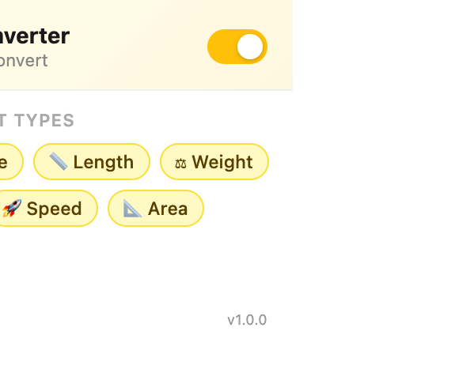

# Unit Converter - Auto Highlight (Chrome Extension)

Automatically detects common units on web pages, highlights them, and shows quick conversions on hover.

## Features

Detects and converts:
- Temperature (`F`, `C`, `K`)
- Length (`km`, `m`, `cm`, `mm`, `mi`, `ft`, `in`, `yd`)
- Weight (`kg`, `g`, `lb`, `oz`, `tonne`, `ton`)
- Volume (`L`, `mL`, `gal`, `qt`, `pt`, `fl oz`)
- Speed (`mph`, `km/h`, `m/s`, `kph`)
- Area (`sq m`, `sq ft`, `acres`, `ha`, and squared notation like `m²`)
- Currency (symbol and code formats, e.g. `$30`, `CAD $20`, `20 USD`)
- Date/time and duration parsing with local/relative outputs
- Popup toggle to enable/disable highlighting
- Exchange rates fetched from [open.er-api.com](https://open.er-api.com) and cached once per date

## Install (Load Unpacked)

1. Open `chrome://extensions`
2. Enable **Developer mode**
3. Click **Load unpacked**
4. Select this folder: `chrome-unit-converter`

## Usage

1. Open any normal web page
2. Hover highlighted values
3. View converted values in the tooltip/popover
4. Use the extension popup toggle to turn detection on/off

## Project Files

- `manifest.json` - extension configuration (Manifest V3)
- `content.js` / `content.css` - page scanning, highlighting, and popover UI
- `background.js` - exchange-rate fetch + cache logic
- `popup.html` / `popup.js` / `popup.css` - popup UI and controls

## Notes

- Currency conversion depends on network access to `https://open.er-api.com/*`
- Some pages (for example `chrome://` pages) do not allow content scripts
